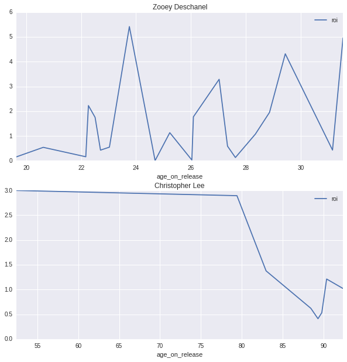
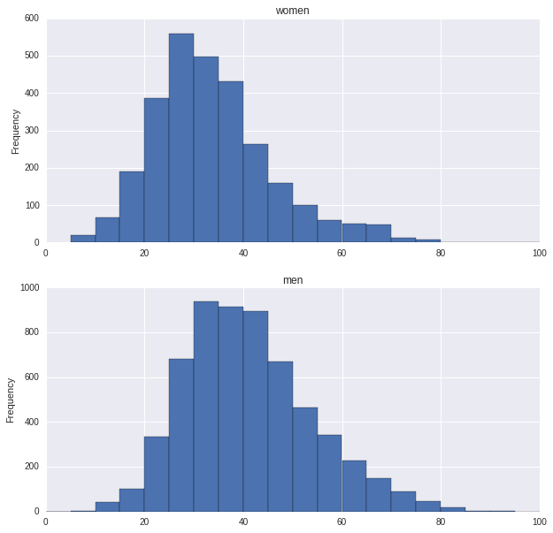

# Polynomial Lasso Results

## ROI Plots

## Distribution of actor ages on movie release date by gender

## Polnomial regression
**R-Squared Score: `0.070427987386787683`**

<table class="dataframe" border="1">
  <thead>
    <tr style="text-align: right;">
      <th></th>
      <th>feature</th>
      <th>coef</th>
    </tr>
  </thead>
  <tbody>
    <tr>
      <th>11</th>
      <td>`age_on_release * male`</td>
      <td>161063.863026</td>
    </tr>
    <tr>
      <th>2</th>
      <td>`age_on_release`</td>
      <td>154906.948951</td>
    </tr>
    <tr>
      <th>1</th>
      <td>`bday_year`</td>
      <td>17192.231399</td>
    </tr>
    <tr>
      <th>9</th>
      <td>`age_on_release^2`</td>
      <td>1332.403377</td>
    </tr>
    <tr>
      <th>8</th>
      <td>`bday_year * male`</td>
      <td>566.253889</td>
    </tr>
    <tr>
      <th>6</th>
      <td>`bday_year * age_on_release`</td>
      <td>312.896110</td>
    </tr>
    <tr>
      <th>7</th>
      <td>`bday_year * release_year`</td>
      <td>302.579963</td>
    </tr>
    <tr>
      <th>10</th>
      <td>`age_on_release * release_year`</td>
      <td>137.016390</td>
    </tr>
    <tr>
      <th>5</th>
      <td>`bday_year^2`</td>
      <td>81.874260</td>
    </tr>
    <tr>
      <th>0</th>
      <td>`1`</td>
      <td>0.000000</td>
    </tr>
    <tr>
      <th>3</th>
      <td>`release`</td>
      <td>0.000000</td>
    </tr>
    <tr>
      <th>4</th>
      <td>`male`</td>
      <td>0.000000</td>
    </tr>
    <tr>
      <th>12</th>
      <td>`release^2`</td>
      <td>0.000000</td>
    </tr>
    <tr>
      <th>13</th>
      <td>`release_year * male`</td>
      <td>0.000000</td>
    </tr>
    <tr>
      <th>14</th>
      <td>`male^2`</td>
      <td>0.000000</td>
    </tr>
  </tbody>
</table>
