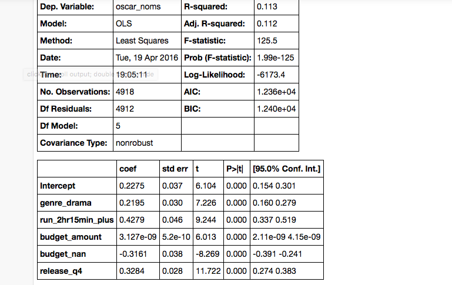

##Oscar Bait: A Scientific Investigation
###Minimum Viable Product

####Research Question
In popular culture, the term "Oscar Bait" refers to a film that is produced with the express purpose of tallying up academy award nominations and wins (often at the expense of audience enjoyment and even box office returns). These films are typically highly produced, epic-length drama's involving "heavy" themes such as disability, war, and internal turmoil. These film's are also notoriously often released during the last three months of the calendar so as to be "fresh" in the minds of the academy.

But do these types of films actually get more Oscar nominations overall, or does it just seem that way? For Project Luther, I set out to investigate whether there was actual relationship between "Oscar Bait" film characteristics and the number of Oscar nominations received.

####Data and Analysis
For my analysis, I scraped data for N=6,978 films released between 2005 and 2015 from [Box Office Mojo](http://www.boxofficemojo.com/). I then used OLS linear regression to regress the number of Oscar nominations on:

* **Drama Genre Dummy:** 0/1 indicator of whether or not the film was a drama.
* **Epic Length Dummy:** 0/1 indicator if the film was of appropriate "epic" length (e.g. 2 hours 15 minutes or longer).
* **Production Budget:** Production budget (dummy adjusted, set to =0 if NaN).
* **Production Budget Missing Dummy:** 0/1 indicator if production budget is missing, used to control for non-randomness in budget missingness.
* **Q4 Released:** 0/1 indicator for release during the last three months.

OLS regression results are shown below. As you can see, there appears to be a positive relationship between drama, runtime, production budget, and a Q4 release on the number of Oscar nominations received, as expected.

####Moving Forwards
I feel that the above analysis is potentially subject to Omitted Variable Bias. There are factors that may affect Oscar nominations that may be correlated with the above explanatory variables.

The most missing feature that may create omitted variable bias is a metric for movie quality. To rectify, I hope to pull audience and critical reception for movies from [Rotten Tomatoes](http://www.rottentomatoes.com/) into the analysis.